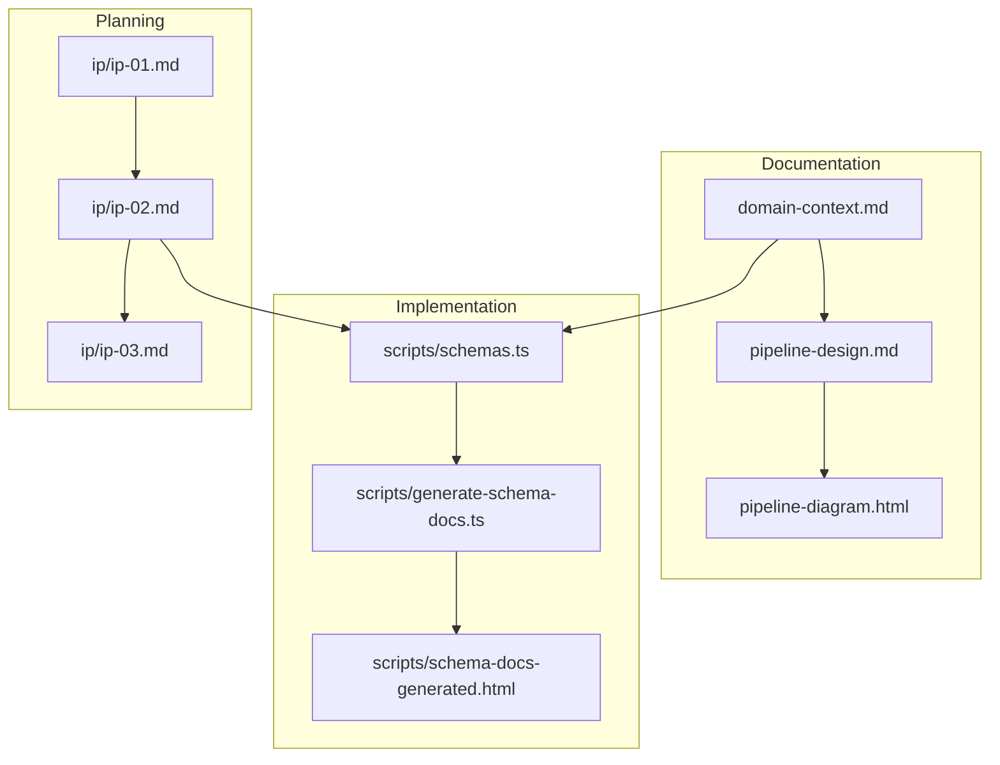

# Score Post-LLM Pipeline

Documentation and implementation for the score processing pipeline that transforms raw LLM evaluation scores into curved letter grades.

## Directory Structure

### Active Documentation

| File | Description |
|------|-------------|
| `domain-context.md` | Core domain model explaining the score transformation pipeline concepts |
| `pipeline-design.md` | Technical design document for pipeline architecture |
| `pipeline-diagram.html` | Visual diagram of the pipeline flow |

### Subdirectories

| Directory | Description |
|-----------|-------------|
| `scripts/` | Working TypeScript implementations (schema docs generator, e2e tests) |
| `ip/` | Iteration plans documenting design decisions and changes |
| `comment/` | Review comments and feedback |
| `archive/` | Historical documents from initial design phase |

## Historical Files

The following files have historical value documenting early design decisions:

- `ip/ip-01.md` - First iteration plan (historical, superseded by ip-02)
- `comment/cm-01.md` - Initial design feedback

## Archive

The `archive/` folder contains early design documents that are no longer current but preserved for reference:

- `design-anna-v0.md` - Original design proposal
- `clarifying-questions.md` - Questions from initial requirements gathering
- `meeting-for-design.txt` - Meeting notes from design sessions

## File Relationships

