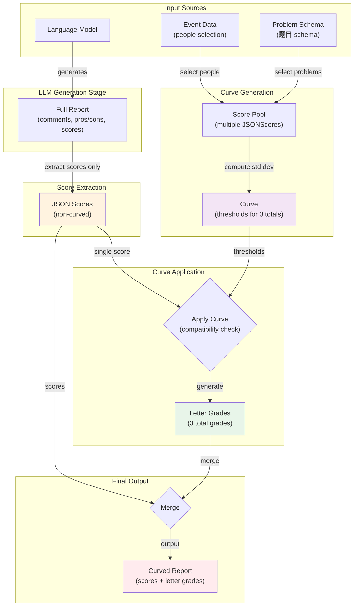
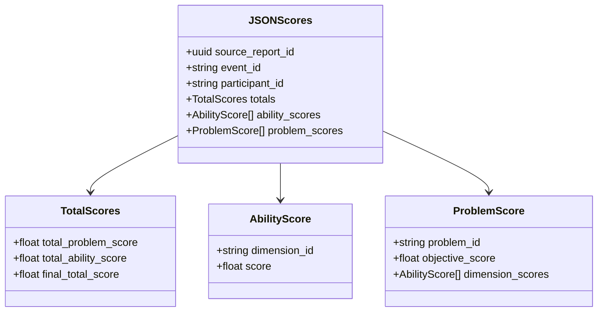
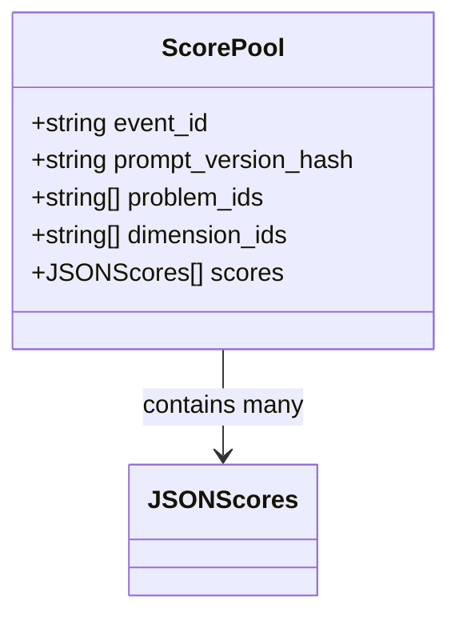
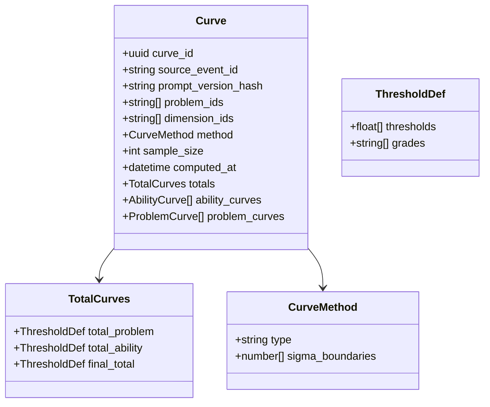
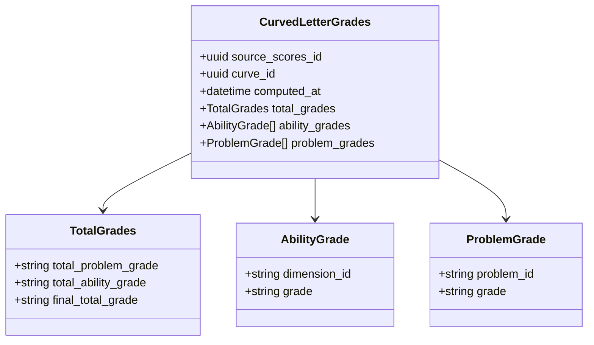
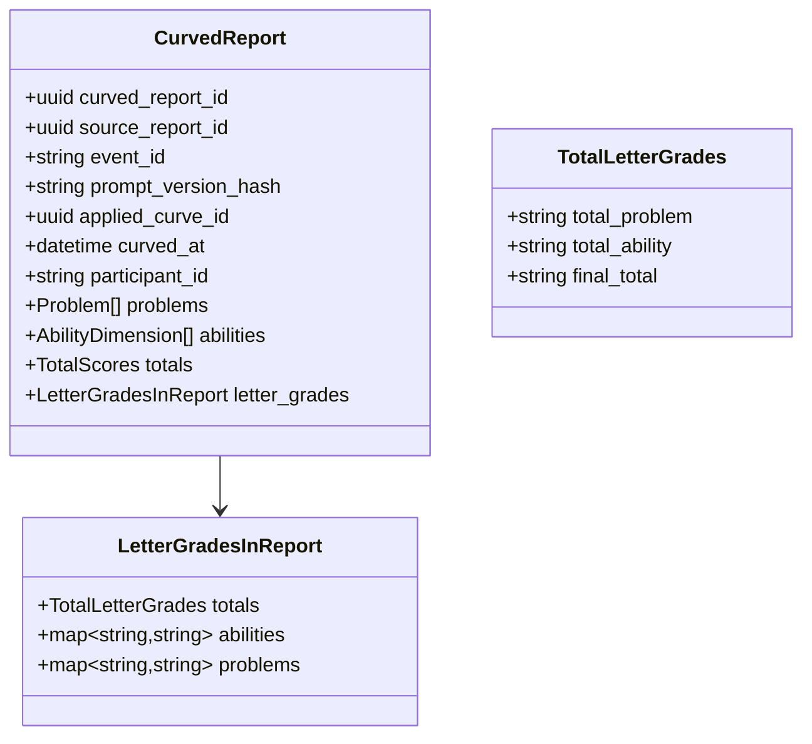
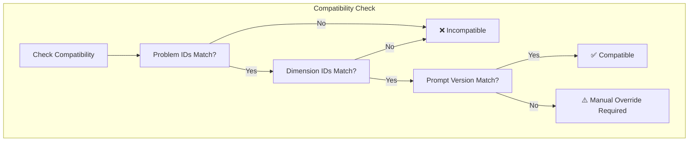

# Score Post-LLM Pipeline Design

## Key Design Decisions (from ip-02.md)

1. **A report that has not been curved does not have letter grades** - `letter_grades` must be `null` for uncurved reports
2. **To create a curve, we need multiple scores** - curve is computed from a pool of participants
3. **To apply a curve, we need only one score** - curve is applied to individual participants
4. **Start from report-scores, not full report** - the full report has comments, pros/cons, etc. We extract just the scores first

### Two Core Schemas

| Schema | Description | Has Letter Grades? |
|--------|-------------|-------------------|
| `JSONScores` | Non-curved extracted scores | No |
| `CurvedReport` | Scores + letter grades | Yes |

## Pipeline Overview



## Data Schema Definitions

### 1. JSON Scores Schema (Non-curved - Pipeline Input)

The pipeline starts from extracted scores, not the full report. This keeps the pipeline focused on scoring logic.



**Key Fields:**
- `totals.total_problem_score`: Average of all problem objective scores
- `totals.total_ability_score`: Average of all dimension scores
- `totals.final_total_score`: Geometric mean √(total_problem × total_ability)

### 2. Score Pool Schema (Curve Computation Input)



**Requirement:** Need multiple participants' scores to compute a meaningful curve.

### 3. Curve Schema



**Curve Method:** Standard deviation based
- A: score ≥ μ + σ
- B: score ≥ μ
- C: score ≥ μ - σ
- D: score < μ - σ

### 4. Curved Letter Grades Schema



### 5. Curved Report Schema (Final Output)



**Key Addition:**
- `applied_curve_id`: Records which curve was applied (traceability)
- `letter_grades.totals`: Three letter grades for the three total scores

## Compatibility Rules (兼容性规则)



### Compatibility Conditions

| Condition | Requirement | Notes |
|-----------|-------------|-------|
| Problem IDs | Must match | Language suffix (0/1) may differ |
| Dimension IDs | Must match | Same ability dimensions |
| Prompt Version | Should match | Different versions require manual override |
| Event ID | Can differ | Curve can apply to different events |

### Problem ID Structure

```
Problem ID: XXXXXX (exactly 6 digits)
            │    │
            │    └─ Language: 0=EN, 1=ZH
            └────── Base ID: Problem identifier (5 digits)
```

**Example:** `003401` → Problem 00340, Chinese version

## Design Principles (设计原则)

1. **No In-Place Modification (不进行原地修改)**
   - Original data and processed data stored separately
   - Modified data is a new entity, never overwrites original

2. **Start from Scores, Not Full Reports**
   - Full reports contain comments, pros/cons, etc.
   - Pipeline only needs scores for curving
   - Separation of concerns

3. **Explicit Metadata (显式元数据)**
   - All critical info recorded explicitly
   - Schema-defined, not convention-based

4. **JSON over CSV (JSON 优于 CSV)**
   - JSON supports hierarchical structure
   - Stricter validation

5. **Validation at Every Step (每步都校验)**
   - Each transformation requires validation
   - Ensures data correctness

6. **Traceability (可追溯性)**
   - Any Curved Report traces back to its Curve
   - Any Curve traces back to source Event and Prompt version

## The 5 Ability Dimensions

| Dimension ID | Chinese Name | Description |
|--------------|--------------|-------------|
| `discovery` | 发现与自我理解 | Discovery and self-understanding |
| `representation` | 表达与转译 | Expression and translation |
| `iterative-refinement` | 迭代与反馈 | Iteration and feedback |
| `exploratory` | 探索式发现 | Exploratory discovery |
| `self-verification` | 验证 | Verification |

## Schema Location

**Single source of truth:** `scripts/schemas.ts`

All Zod schemas are defined in this file. Other files import from here.
