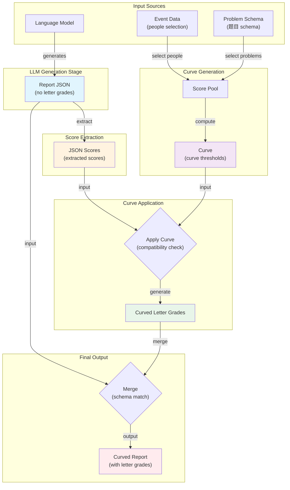
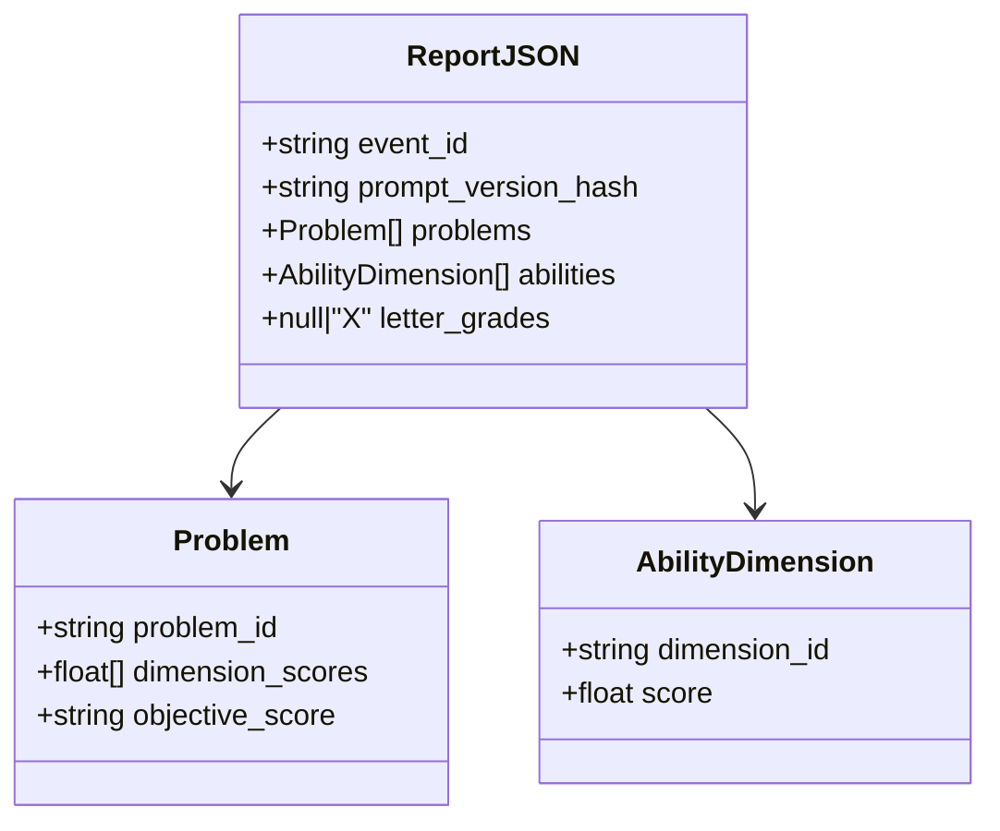
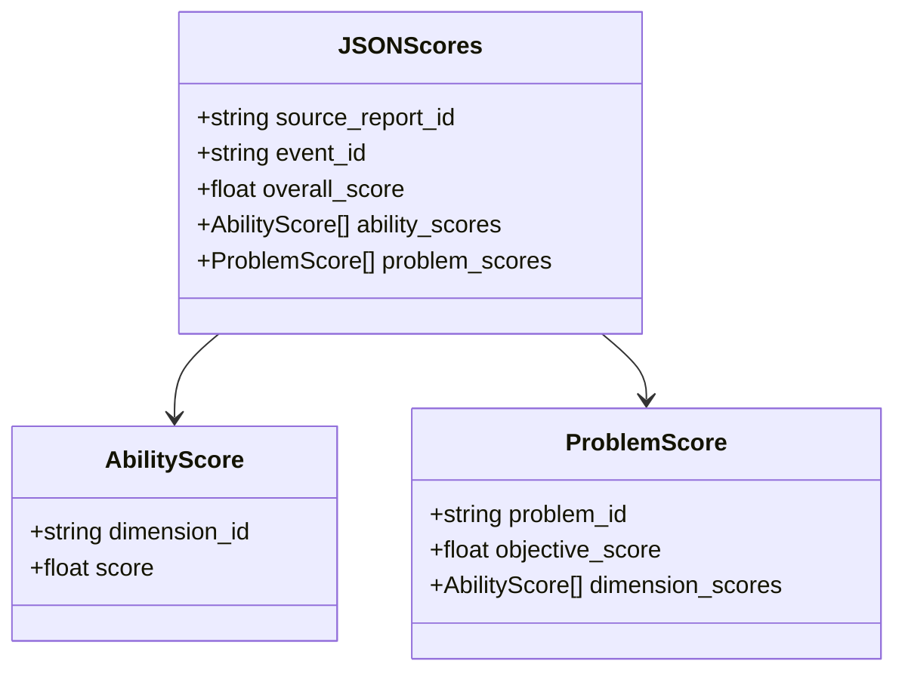
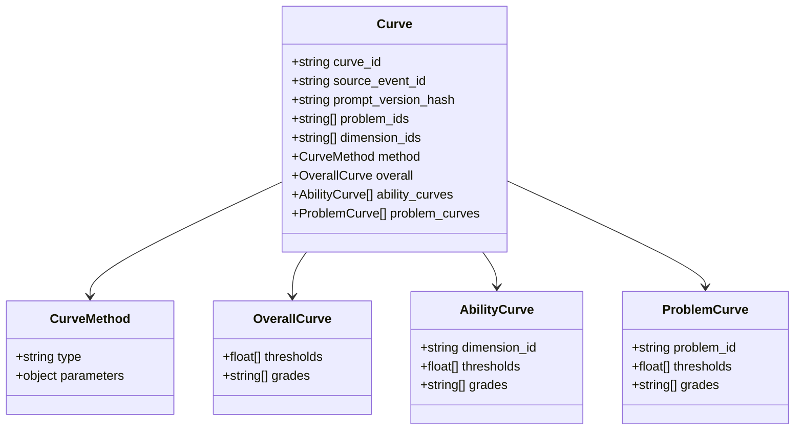
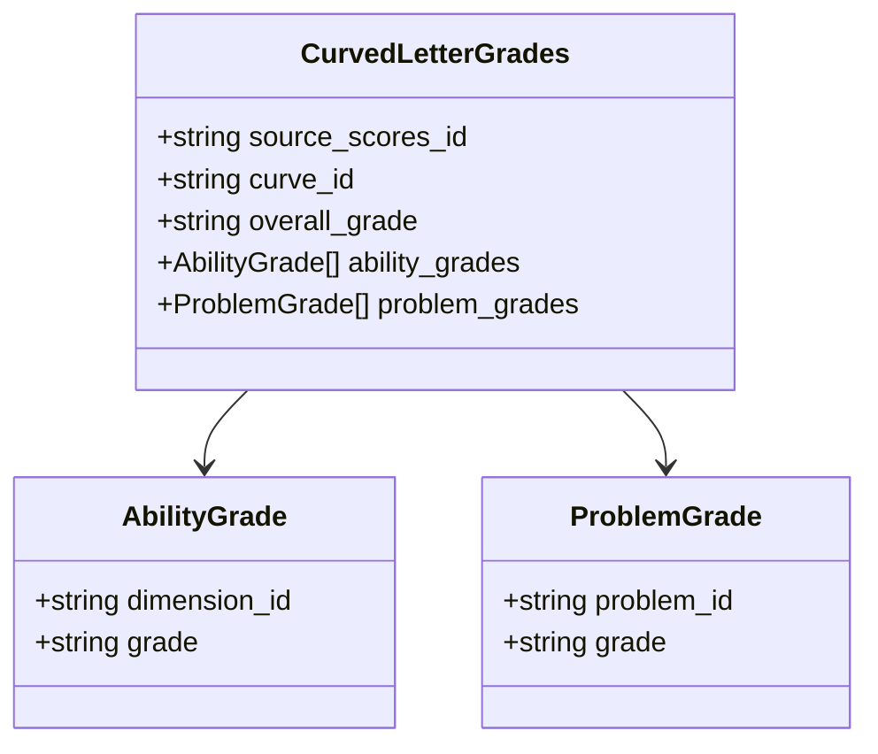
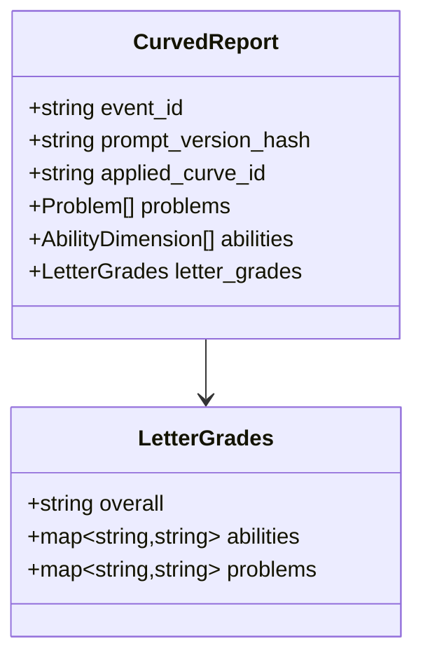
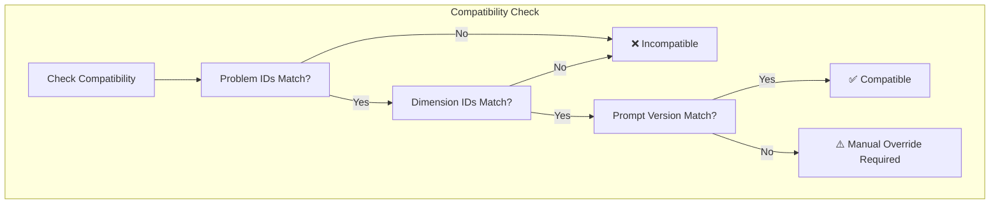
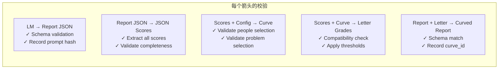
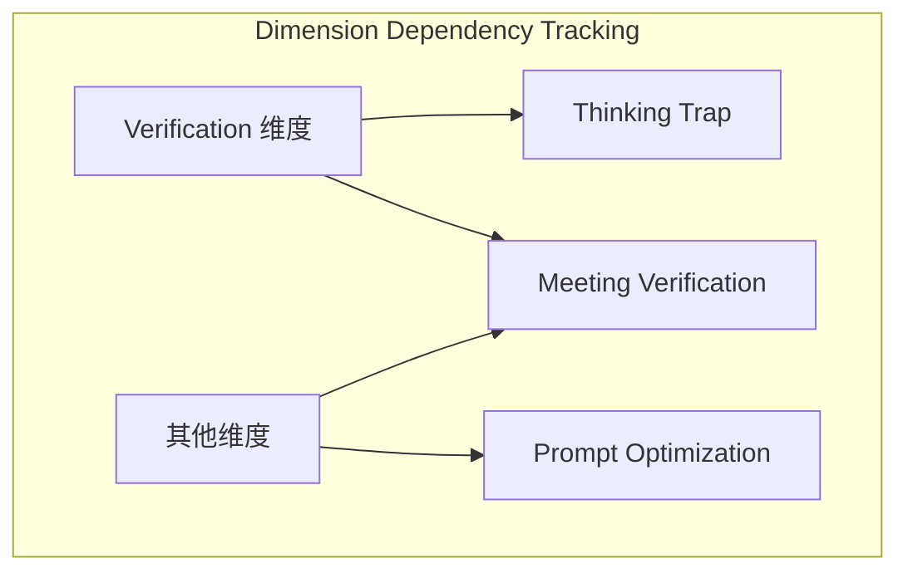

# Score Post-LLM Pipeline Design

## Pipeline Overview



## Data Schema Definitions

### 1. Report JSON Schema (原始报告 - 无 letter grades)



**Key Fields:**
- `event_id`: 事件标识符
- `prompt_version_hash`: Git commit hash (运行时的 prompt 版本)
- `problems`: 每道题目的分数
- `abilities`: 每个能力维度的分数
- `letter_grades`: 默认为 `null` 或 `"X"`，表示未 curve

### 2. JSON Scores Schema (提取的分数)



### 3. Curve Schema



**Key Fields:**
- `source_event_id`: Curve 计算来源的 event
- `prompt_version_hash`: 生成分数时使用的 prompt 版本
- `problem_ids`: 包含的题目 ID 列表
- `dimension_ids`: 包含的能力维度 ID 列表
- `method`: Curve 计算方法（如：平均分 ± 标准差）

### 4. Curved Letter Grades Schema



### 5. Curved Report Schema (最终报告)



**Key Addition:**
- `applied_curve_id`: 记录应用了哪个 curve（可追溯）

## Compatibility Rules (兼容性规则)



### Compatibility Conditions

| Condition | Requirement | Notes |
|-----------|-------------|-------|
| Problem IDs | Must match | Language suffix (0/1) may differ |
| Dimension IDs | Must match | Same ability dimensions |
| Prompt Version | Should match | Different versions require manual override |
| Event ID | Can differ | Curve can apply to different events |

### Problem ID Structure

```
Problem ID: XXXXXX[V][L]
            │     │  │
            │     │  └─ Language: 0=Chinese, 1=English
            │     └─── Version: Major version changes
            └───────── Base ID: Problem identifier
```

**Example:** `9034943[1]` → Problem 903494, Version 3, English

## Transformation Rules (转换规则)



## Design Principles (设计原则)

1. **No In-Place Modification (不进行原地修改)**
   - 原始数据和处理后数据分开存储
   - 改过的数据是新的实体，不覆盖原数据

2. **Explicit Metadata (显式元数据)**
   - 所有关键信息必须显式记录
   - 不依赖约定，依赖 schema 定义

3. **JSON over CSV (JSON 优于 CSV)**
   - JSON 支持层级结构
   - JSON 校验更严格、更方便

4. **Validation at Every Step (每步都校验)**
   - 每个数据转换都需要校验
   - 确保数据正确性

5. **Traceability (可追溯性)**
   - 任何 Curved Report 都能追溯到使用的 Curve
   - 任何 Curve 都能追溯到来源 Event 和 Prompt 版本

## Prompt Versioning Strategy (Prompt 版本策略)

### Current Approach (当前方案)
- 使用统一的 Git commit hash 标识所有 prompt 的版本
- 任何 prompt 变化都会产生新的 commit hash

### Future Approach (未来方案)
- 每个 prompt 单独版本化
- Prompts 包括:
  - Ability Summary
  - Problem Summary
  - Final Summary
  - Expert Review
  - Per-ability Expert Review
  - Per-problem Scoring Criteria

## Dimension-Problem Dependency (维度-题目依赖关系)



**重要:** 需要显式记录每个维度依赖哪些题目，以便：
- 确定题目子集是否能产生有意义的维度分数
- 支持跨 Event 的题目复用
