# Score Post-LLM Pipeline: Complete Flow Documentation

> Generated from `schema-verify-v1.ts` Zod schemas

---

## Table of Contents

1. [Pipeline Overview](#1-pipeline-overview)
2. [Stage 1: LLM Report Generation](#2-stage-1-llm-report-generation)
3. [Stage 2: Score Extraction](#3-stage-2-score-extraction)
4. [Stage 3: Curve Generation](#4-stage-3-curve-generation)
5. [Stage 4: Curve Application](#5-stage-4-curve-application)
6. [Stage 5: Report Merge](#6-stage-5-report-merge)
7. [Compatibility Validation](#7-compatibility-validation)
8. [Schema Details](#8-schema-details)

---

## 1. Pipeline Overview

The pipeline transforms raw LLM evaluation reports into curved, graded reports through a series of validated transformations.

```mermaid
flowchart TB
    subgraph Input["📥 Input Sources"]
        LLM["🤖 LLM Evaluation<br/>Engine"]
        Events["📋 Event Selection<br/>(Manual)"]
        Label["🏷️ Curve Label<br/>(Manual Input)"]
    end

    subgraph Stage1["Stage 1: LLM Generation"]
        LLM --> LLMReport["📄 LLMReport<br/><i>grades = 'X' (uncurved)</i>"]
    end

    subgraph Stage2["Stage 2: Score Extraction"]
        LLMReport --> |"extract scores"| JSONScores["📊 JSONScores<br/><i>flat score structure</i>"]
    end

    subgraph Stage3["Stage 3: Curve Generation"]
        Events --> |"select events"| ScorePool["🗃️ Score Pool<br/><i>multiple JSONScores</i>"]
        ScorePool --> |"validate"| CompatCheck1{"🔍 Compatibility<br/>Check"}
        CompatCheck1 --> |"✅ pass"| CurveCompute["📈 Compute<br/>Thresholds"]
        CompatCheck1 --> |"❌ fail"| Error1["⛔ Error: Metadata Mismatch"]
        CurveCompute --> Curve["📐 Curve<br/><i>A/B/C thresholds</i>"]
        Label --> Curve
    end

    subgraph Stage4["Stage 4: Curve Application"]
        JSONScores --> |"input"| CompatCheck2{"🔍 Compatibility<br/>Check"}
        Curve --> |"input"| CompatCheck2
        CompatCheck2 --> |"✅ pass"| ApplyCurve["🎯 Apply<br/>Thresholds"]
        CompatCheck2 --> |"❌ fail"| Error2["⛔ Error: Metadata Mismatch"]
        ApplyCurve --> CurvedGrades["🅰️ CurvedLetterGrades<br/><i>A/B/C/D assigned</i>"]
    end

    subgraph Stage5["Stage 5: Report Merge"]
        CurvedGrades --> Merge["🔗 Merge"]
        LLMReport --> Merge
        Merge --> CurvedReport["📋 CurvedReport<br/><i>final output</i>"]
    end

    style LLMReport fill:#e3f2fd,stroke:#1976d2
    style JSONScores fill:#fff8e1,stroke:#ffa000
    style Curve fill:#f3e5f5,stroke:#7b1fa2
    style CurvedGrades fill:#e8f5e9,stroke:#388e3c
    style CurvedReport fill:#ffebee,stroke:#d32f2f
    style Error1 fill:#ffcdd2,stroke:#c62828
    style Error2 fill:#ffcdd2,stroke:#c62828
```



---

## 2. Stage 1: LLM Report Generation

The LLM generates evaluation reports with placeholder grades (`X`) indicating uncurved status.

```mermaid
flowchart LR
    subgraph Inputs["Inputs"]
        Submission["👤 Participant<br/>Submission"]
        Problems["📝 Problem Set"]
        Prompts["💬 Prompt Templates"]
    end

    subgraph Process["LLM Evaluation"]
        Submission --> Eval["🤖 LLM<br/>Evaluation"]
        Problems --> Eval
        Prompts --> Eval
        Eval --> Report["📄 LLMReport"]
    end

    subgraph Metadata["Captured Metadata"]
        Report --> M1["📋 reportId (UUID)"]
        Report --> M2["🎪 eventId"]
        Report --> M3["👤 participantId"]
        Report --> M4["🔐 promptSetHash (SHA-256)"]
        Report --> M5["📑 entries (sorted prompt fingerprints)"]
        Report --> M6["🔗 dimensionProblemDependency"]
    end
```



### LLMReport Key Fields

| Field | Type | Description |
|-------|------|-------------|
| `metadata.reportId` | UUID | Unique report identifier |
| `metadata.promptSetHash` | SHA-256 | Hash of entire prompt set |
| `metadata.entries` | Array | Sorted prompt fingerprints (key + sha256) |
| `metadata.dimensionProblemDependency` | Array | Problem-dimension mapping |
| `grade` | `'X'` | Uncurved placeholder |
| `problemReports[].grade` | `'X'` | Per-problem uncurved grade |
| `dimensionReports[].grade` | `'X'` | Per-dimension uncurved grade |

---

## 3. Stage 2: Score Extraction

Extract numeric scores from the report into a flat, processable structure.

```mermaid
flowchart LR
    subgraph Source["Source: LLMReport"]
        PR["problemReports[]<br/>.score"]
        DD["problemReports[]<br/>.dimensionDetails[]<br/>.score"]
        DR["dimensionReports[]<br/>.score"]
        OM["overallMean"]
    end

    subgraph Extract["Extraction"]
        PR --> PS["problemScores[]<br/>(score + dimensionDetailScores)"]
        DD --> PS
        DR --> AS["abilityScores[]"]
        OM --> Overall["overallMean"]
    end

    subgraph Output["Output: JSONScores"]
        PS --> JSONScores["📊 JSONScores"]
        AS --> JSONScores
        Overall --> JSONScores
    end
```



### JSONScores Schema


---

## 4. Stage 3: Curve Generation

Generate grade thresholds from a population of scores. This requires **manual input** for event selection and curve labeling.

```mermaid
flowchart TB
    subgraph ManualInput["👤 Manual Input"]
        EventSelect["📋 Select Events<br/>(one or more)"]
        LabelInput["🏷️ Enter Curve Label"]
    end

    subgraph Collection["Score Collection"]
        EventSelect --> |"fetch"| Reports["📄 LLMReports<br/>from selected events"]
        Reports --> |"extract"| Scores["📊 JSONScores[]<br/>(score pool)"]
    end

    subgraph Validation["⚠️ Compatibility Validation"]
        Scores --> Check{"🔍 Check All Scores"}
        Check --> V1["dimensionProblemDependency<br/>must be identical"]
        Check --> V2["promptSetHash<br/>must be identical"]
        V1 --> |"mismatch"| Fail["⛔ FAIL:<br/>Metadata Mismatch"]
        V2 --> |"mismatch"| Fail
        V1 --> |"match"| Pass["✅ Proceed"]
        V2 --> |"match"| Pass
    end

    subgraph Computation["Curve Computation"]
        Pass --> Stats["📈 Compute Statistics<br/>(mean, std dev)"]
        Stats --> Thresholds["📐 Calculate Thresholds<br/>A > μ+σ, B > μ, C > μ-σ"]
    end

    subgraph Output["Output"]
        Thresholds --> Curve["📐 Curve"]
        LabelInput --> Curve
        Curve --> CurveData["curveId: UUID<br/>label: string<br/>sourceEventIds: string[]<br/>sampleSize: number<br/>method: 'standard_deviation'"]
    end

    style Fail fill:#ffcdd2,stroke:#c62828
    style Pass fill:#c8e6c9,stroke:#388e3c
```



### Curve Schema


### Grade Threshold Logic

```
Score >= A threshold  →  Grade A
Score >= B threshold  →  Grade B
Score >= C threshold  →  Grade C
Score <  C threshold  →  Grade D
```

---

## 5. Stage 4: Curve Application

Apply curve thresholds to individual scores to produce letter grades.

```mermaid
flowchart TB
    subgraph Inputs["Inputs"]
        JS["📊 JSONScores<br/>(from Stage 2)"]
        C["📐 Curve<br/>(from Stage 3)"]
    end

    subgraph Validation["⚠️ Compatibility Validation"]
        JS --> Check{"🔍 Check Compatibility"}
        C --> Check
        Check --> V1["Compare<br/>dimensionProblemDependency"]
        Check --> V2["Compare<br/>promptSetHash"]
        V1 --> |"mismatch"| Fail["⛔ FAIL:<br/>Cannot apply curve"]
        V2 --> |"mismatch"| Fail
        V1 --> |"match"| Pass["✅ Proceed"]
        V2 --> |"match"| Pass
    end

    subgraph Application["Grade Assignment"]
        Pass --> ApplyOverall["Apply overall threshold"]
        Pass --> ApplyAbility["Apply ability thresholds"]
        Pass --> ApplyDimensionDetail["Apply ability thresholds<br/>to (problem, dimension) scores"]
        Pass --> ApplyProblem["Apply problem thresholds"]
        ApplyOverall --> OG["overallGrade: A|B|C|D"]
        ApplyAbility --> AG["abilityGrades: Record"]
        ApplyDimensionDetail --> DG["dimensionDetailGrades: Record"]
        ApplyProblem --> PG["problemGrades: Record"]
    end

    subgraph Output["Output"]
        OG --> CLG["🅰️ CurvedLetterGrades"]
        AG --> CLG
        DG --> CLG
        PG --> CLG
        CLG --> Meta["curveId: UUID<br/>computedAt: datetime"]
    end

    style Fail fill:#ffcdd2,stroke:#c62828
    style Pass fill:#c8e6c9,stroke:#388e3c
```



### CurvedLetterGrades Schema


**Grade derivation (inputs → curve field):**
- `overallGrade`: `JSONScores.overallMean` → `Curve.overall`
- `abilityGrades[dimension]`: `JSONScores.abilityScores[*].score` → `Curve.abilityCurves[dimension]`
- `problemGrades[problemId]`: `JSONScores.problemScores[*].score` → `Curve.problemCurves[problemId]`
- `dimensionDetailGrades[problemId][dimension]`: `JSONScores.problemScores[*].dimensionDetailScores[*].score` → `Curve.abilityCurves[dimension]`

---

## 6. Stage 5: Report Merge

Merge the curved letter grades back into the original report structure.

```mermaid
flowchart LR
    subgraph Inputs["Inputs"]
        LLMReport["📄 LLMReport<br/>(grades = 'X')"]
        CLG["🅰️ CurvedLetterGrades"]
    end

    subgraph Merge["Merge Process"]
        LLMReport --> M["🔗 Merge"]
        CLG --> M
        M --> |"replace 'X' with<br/>A/B/C/D"| Transform["Transform"]
    end

    subgraph Output["Output: CurvedReport"]
        Transform --> CR["📋 CurvedReport"]
        CR --> F1["metadata.curveId added"]
        CR --> F9["metadata.curvedAt added"]
        CR --> F2["grade: A|B|C|D"]
        CR --> F3["problemReports[].grade: A|B|C|D"]
        CR --> F7["problemReports[].dimensionDetails[].grade: A|B|C|D"]
        CR --> F4["dimensionReports[].grade: A|B|C|D"]
        CR --> F8["dimensionReports[].problems[].grade: A|B|C|D"]
        CR --> F5["dimensionCards[].grade: A|B|C|D"]
        CR --> F6["problemCards[].grade: A|B|C|D"]
    end

    style CR fill:#ffebee,stroke:#d32f2f
```



### Schema Transformation

| CurvedReport Field | Before (LLMReport) | After (CurvedReport) | Derived from |
|---|---|---|---|
| `grade` | `'X'` | `'A' \| 'B' \| 'C' \| 'D'` | `CurvedLetterGrades.overallGrade` (`JSONScores.overallMean` + `Curve.overall`) |
| `dimensionCards[].grade` | `'X'` | `'A' \| 'B' \| 'C' \| 'D'` | `CurvedLetterGrades.abilityGrades[dimension]` (`JSONScores.abilityScores[*].score` + `Curve.abilityCurves[dimension]`) |
| `dimensionReports[].grade` | `'X'` | `'A' \| 'B' \| 'C' \| 'D'` | `CurvedLetterGrades.abilityGrades[dimension]` (`JSONScores.abilityScores[*].score` + `Curve.abilityCurves[dimension]`) |
| `dimensionReports[].problems[].grade` | `'X'` | `'A' \| 'B' \| 'C' \| 'D'` | `CurvedLetterGrades.dimensionDetailGrades[problemId][dimension]` (`JSONScores.problemScores[*].dimensionDetailScores[*].score` + `Curve.abilityCurves[dimension]`) |
| `problemCards[].grade` | `'X'` | `'A' \| 'B' \| 'C' \| 'D'` | `CurvedLetterGrades.problemGrades[problemId]` (`JSONScores.problemScores[*].score` + `Curve.problemCurves[problemId]`) |
| `problemReports[].grade` | `'X'` | `'A' \| 'B' \| 'C' \| 'D'` | `CurvedLetterGrades.problemGrades[problemId]` (`JSONScores.problemScores[*].score` + `Curve.problemCurves[problemId]`) |
| `problemReports[].dimensionDetails[].grade` | `'X'` | `'A' \| 'B' \| 'C' \| 'D'` | `CurvedLetterGrades.dimensionDetailGrades[problemId][dimension]` (`JSONScores.problemScores[*].dimensionDetailScores[*].score` + `Curve.abilityCurves[dimension]`) |
| `metadata.curveId` | N/A | UUID (added) | `CurvedLetterGrades.curveId` |
| `metadata.curvedAt` | N/A | datetime (added) | `CurvedLetterGrades.computedAt` (or merge time) |

---

## 7. Compatibility Validation

Critical validation gates that ensure data consistency across the pipeline.


### Why These Checks Matter

| Check | Purpose | Failure Scenario |
|-------|---------|------------------|
| `dimensionProblemDependency` | Ensures same problem-dimension mapping | Different problem sets would produce incomparable scores |
| `promptSetHash` | Ensures same evaluation prompts | Different prompts could produce systematically different scores |

---

## 8. Schema Details

### Common Types Reference

#### ProblemId

```typescript
// Format: "XXXXXX-title" where XXXXXX is 6 digits
// Example: "001231-thinking-trap"
ProblemIdSchema = z.string().regex(/^\d{6}-.+$/)
```

| Digit Position | Meaning | Example |
|----------------|---------|---------|
| 1-4 | Major version | `0012` → v12 |
| 5 | Minor version | `3` → minor v3 |
| 6 | Language | `0` = Chinese, `1` = English |
| After `-` | Title | `thinking-trap` |

#### ScoreValue

```typescript
// Normalized score in range [0, 1]
ScoreValueSchema = z.number().min(0).max(1)
```

#### Sha256Hex

```typescript
// SHA-256 hex digest (64 lowercase hex chars)
Sha256HexSchema = z.string().regex(/^[a-f0-9]{64}$/)
```

#### PromptSnapshotEntry

```typescript
PromptSnapshotEntrySchema = z.object({
  key: z.string().min(1),    // e.g., "framework:zh:task-eval", "problem:001111:scoring"
  sha256: Sha256HexSchema,   // SHA-256 of prompt file content
})
```

**Validation Rules:**
- `entries` array must be **sorted by key** (stable order)
- Keys must be **unique**

#### DimensionProblemDependency

```typescript
DimensionProblemDependencySchema = z.object({
  problemId: ProblemIdSchema,
  problemVersion: z.number().int().nonnegative(),
  dimensions: z.array(DimensionSchema),  // Which dimensions this problem evaluates
})
```

#### CurvedGrade

```typescript
// Letter grades: A, B, C, D
CurvedGradeSchema = z.enum(['A', 'B', 'C', 'D'])
```

#### UncurvedGrade

```typescript
// Uncurved grade: X
UncurvedGradeSchema = z.literal('X')
```

---

### 1. LLMReport Schema (Complete)


#### LLMReport Field Details

| Field | Type | Description |
|-------|------|-------------|
| `metadata` | Metadata | Report metadata including versioning info |
| `dimensionCards` | DimensionCard[] | Summary cards for each ability dimension |
| `dimensionReports` | DimensionReport[] | Detailed reports per dimension |
| `overall` | Overall | Overall evaluation summary |
| `problemCards` | ProblemCard[] | Summary cards for each problem |
| `problemReports` | ProblemReport[] | Detailed reports per problem |
| `taskEvalMean` | number \| null | Mean of all task evaluation scores |
| `abilityMean` | number \| null | Mean of all ability dimension scores |
| `overallMean` | number \| null | Combined overall mean score |
| `grade` | `'X'` | Uncurved placeholder grade |

#### Metadata Field Details

| Field | Type | Description |
|-------|------|-------------|
| `lang` | `'en' \| 'zh'` | Report language |
| `reportId` | UUID | Unique report identifier |
| `eventId` | string | Event this report belongs to |
| `participantId` | string | Participant identifier |
| `promptSetHash` | SHA-256 | Hash of entire prompt set (sorted) |
| `entries` | PromptSnapshotEntry[] | Individual prompt fingerprints |
| `dimensionProblemDependency` | DimensionProblemDependency[] | Problem-dimension mapping |
| `createdAt` | ISO datetime | Report generation timestamp |

---

### 2. JSONScores Schema (Complete)

```typescript
JSONScoresSchema = z.object({
  abilityScores: z.array(AbilityScoreSchema),
  problemScores: z.array(ProblemScoreSchema),
  overallMean: ScoreValueSchema,
})

AbilityScoreSchema = z.object({
  dimensionId: DimensionSchema,
  score: ScoreValueSchema,  // Source: Report.dimensionReports[].score
})

ProblemScoreSchema = z.object({
  problemId: ProblemIdSchema,
  score: ScoreValueSchema,  // Source: Report.problemReports[].score
  dimensionDetailScores: z.array(DimensionDetailScoreSchema),
})

DimensionDetailScoreSchema = z.object({
  dimensionId: DimensionSchema,
  score: ScoreValueSchema,  // Source: Report.problemReports[].dimensionDetails[].score
})
```

| Field | Source in LLMReport | Description |
|-------|---------------------|-------------|
| `abilityScores[].score` | `dimensionReports[].score` | Average ability score for dimension |
| `problemScores[].score` | `problemReports[].score` | Task score for problem |
| `problemScores[].dimensionDetailScores[].score` | `problemReports[].dimensionDetails[].score` | Ability score for (problem, dimension) |
| `overallMean` | `overallMean` | Combined overall mean |

---

### 3. Curve Schema (Complete)

```typescript
CurveSchema = z.object({
  curveId: z.string().uuid(),
  label: z.string().min(1),
  sourceEventIds: z.array(EventIdSchema),
  promptSetHash: Sha256HexSchema,
  entries: PromptSnapshotEntriesSchema,
  dimensionProblemDependency: DimensionProblemDependencyListSchema,
  method: z.literal('standard_deviation'),
  sampleSize: z.number().int().positive(),
  createdAt: z.string().datetime(),
  abilityCurves: z.record(DimensionSchema, GradeThresholdsSchema),
  problemCurves: z.record(ProblemIdSchema, GradeThresholdsSchema),
  overall: GradeThresholdsSchema,
})

GradeThresholdsSchema = z.object({
  A: ScoreValueSchema,  // Minimum score for grade A
  B: ScoreValueSchema,  // Minimum score for grade B
  C: ScoreValueSchema,  // Minimum score for grade C
  // D is implied: score < C
})
```

| Field | Type | Description |
|-------|------|-------------|
| `curveId` | UUID | Unique curve identifier |
| `label` | string | Human-readable curve name (manual input) |
| `sourceEventIds` | string[] | Events used to compute this curve |
| `promptSetHash` | SHA-256 | Must match reports being curved |
| `entries` | PromptSnapshotEntry[] | Prompt fingerprints (must match) |
| `dimensionProblemDependency` | Array | Problem-dimension mapping (must match) |
| `method` | `'standard_deviation'` | Computation method |
| `sampleSize` | number | Number of participants in sample |
| `createdAt` | datetime | Curve creation timestamp |
| `abilityCurves` | Record | Per-dimension thresholds |
| `problemCurves` | Record | Per-problem thresholds |
| `overall` | GradeThresholds | Overall score thresholds |

---

### 4. CurvedLetterGrades Schema (Complete)

```typescript
CurvedLetterGradesSchema = z.object({
  curveId: z.string().uuid(),          // Reference to Curve used
  computedAt: z.string().datetime(),   // When grades were computed
  // Derived from: JSONScores.overallMean + Curve.overall
  overallGrade: CurvedGradeSchema,     // 'A' | 'B' | 'C' | 'D'
  // Derived from: JSONScores.abilityScores[*].score + Curve.abilityCurves[dimension]
  abilityGrades: z.record(DimensionSchema, CurvedGradeSchema),
  // Derived from: JSONScores.problemScores[*].score + Curve.problemCurves[problemId]
  problemGrades: z.record(ProblemIdSchema, CurvedGradeSchema),
  // Derived from: JSONScores.problemScores[*].dimensionDetailScores[*].score + Curve.abilityCurves[dimension]
  dimensionDetailGrades: z.record(ProblemIdSchema, z.record(DimensionSchema, CurvedGradeSchema)),
})
```

**Purpose:** In-memory intermediate artifact that captures the grade assignment result before merging into the final report (including nested per-problem-per-dimension grades).

---

### 5. CurvedReport Schema (Complete)

The CurvedReport extends LLMReport with curved grades:


**Key Differences from LLMReport:**
- `metadata.curveId` added (UUID reference to applied curve)
- All `grade` fields changed from `'X'` to `'A' | 'B' | 'C' | 'D'`

---

### Dimension Enum Values

```typescript
DimensionSchema = z.enum([
  'representation',       // Problem-solving approach and solution representation
  'self-verification',    // Checking and validating own work
  'iterative-refinement', // Improving and refining solutions
  'discovery',            // Finding new insights and patterns
  'exploratory',          // Exploring possibilities and alternatives
])
```

---

### Problem ID Format


### Complete Data Flow

```mermaid
flowchart TB
    subgraph Artifacts["📦 Data Artifacts"]
        A1["📄 LLMReport<br/><code>grade: 'X'</code>"]
        A2["📊 JSONScores<br/><code>scores only</code>"]
        A3["📐 Curve<br/><code>thresholds</code>"]
        A4["🅰️ CurvedLetterGrades<br/><code>grades only</code>"]
        A5["📋 CurvedReport<br/><code>grade: A|B|C|D</code>"]
    end

    subgraph Flow["Data Flow"]
        A1 --> |"extract"| A2
        A2 --> |"+ other JSONScores<br/>from same config"| A3
        A2 --> |"+ Curve"| A4
        A1 --> |"+ CurvedLetterGrades"| A5
        A4 --> A5
    end

    subgraph Traceability["🔍 Traceability"]
        A5 --> |"metadata.curveId"| A3
        A4 --> |"curveId"| A3
        A4 --> |"problemScores[].dimensionDetailScores"| A2
        A3 --> |"sourceEventIds"| Events["Events"]
    end

    style A1 fill:#e3f2fd
    style A2 fill:#fff8e1
    style A3 fill:#f3e5f5
    style A4 fill:#e8f5e9
    style A5 fill:#ffebee
```



### Dimension Types


---

## Appendix: Quick Reference

### Pipeline Stages Summary

| Stage | Input | Output | Key Validation |
|-------|-------|--------|----------------|
| 1. LLM Generation | Submission + Prompts | LLMReport | Schema validation |
| 2. Score Extraction | LLMReport | JSONScores | Completeness check |
| 3. Curve Generation | JSONScores[] + Manual Input | Curve | Metadata consistency |
| 4. Curve Application | JSONScores + Curve | CurvedLetterGrades | Metadata consistency |
| 5. Report Merge | LLMReport + CurvedLetterGrades | CurvedReport | Schema match |

### Grade Mapping

| Raw Grade | Meaning | Curved Grade | Threshold | Meaning |
|-----------|---------|--------------|-----------|---------|
| `'X'` | Uncurved | `'A'` | score ≥ μ + σ | Top tier (top ~16%) |
| | | `'B'` | score ≥ μ | Above average (~34%) |
| | | `'C'` | score ≥ μ - σ | Below average (~34%) |
| | | `'D'` | score < μ - σ | Bottom tier (bottom ~16%) |

---

## Appendix B: JSON Examples

### Example: PromptSnapshotEntry Array

```json
{
  "entries": [
    { "key": "framework:en:expert-review", "sha256": "a1b2c3..." },
    { "key": "framework:en:task-eval", "sha256": "d4e5f6..." },
    { "key": "problem:001110:scoring", "sha256": "g7h8i9..." },
    { "key": "problem:001111:scoring", "sha256": "j0k1l2..." }
  ]
}
```

### Example: DimensionProblemDependency

```json
{
  "dimensionProblemDependency": [
    {
      "problemId": "001110-thinking-trap",
      "problemVersion": 1,
      "dimensions": ["self-verification", "representation"]
    },
    {
      "problemId": "001111-meeting-verification",
      "problemVersion": 0,
      "dimensions": ["self-verification", "discovery"]
    }
  ]
}
```

### Example: GradeThresholds

```json
{
  "overall": {
    "A": 0.85,
    "B": 0.70,
    "C": 0.55
  },
  "abilityCurves": {
    "representation": { "A": 0.82, "B": 0.68, "C": 0.52 },
    "self-verification": { "A": 0.88, "B": 0.72, "C": 0.58 }
  }
}
```

### Example: CurvedLetterGrades

```json
{
  "curveId": "6ba7b810-9dad-11d1-80b4-00c04fd430c8",
  "computedAt": "2024-01-15T10:30:00Z",
  "overallGrade": "B",
  "abilityGrades": {
    "representation": "A",
    "self-verification": "B",
    "iterative-refinement": "C",
    "discovery": "B",
    "exploratory": "A"
  },
  "problemGrades": {
    "001110-thinking-trap": "A",
    "001111-meeting-verification": "B"
  },
  "dimensionDetailGrades": {
    "001110-thinking-trap": {
      "representation": "A",
      "self-verification": "B"
    },
    "001111-meeting-verification": {
      "discovery": "A",
      "self-verification": "B"
    }
  }
}
```

---

## Appendix C: Validation Error Messages

| Schema | Validation | Error Message |
|--------|------------|---------------|
| ProblemId | Format | `Problem ID must be "6digits-title"` |
| ProblemId | Title empty | `Problem ID title part must be non-empty` |
| ProblemId | Language digit | `Problem ID last digit must be 0 (zh) or 1 (en)` |
| Sha256Hex | Format | `Must be a lowercase SHA-256 hex digest` |
| PromptSnapshotEntries | Order | `entries must be sorted by key (stable order)` |
| PromptSnapshotEntries | Uniqueness | `entries keys must be unique` |
| ScoreValue | Range | Implicit: must be between 0 and 1 |
| PromptVersionHash | Format | `Must be a valid git commit hash (short or full)` |
