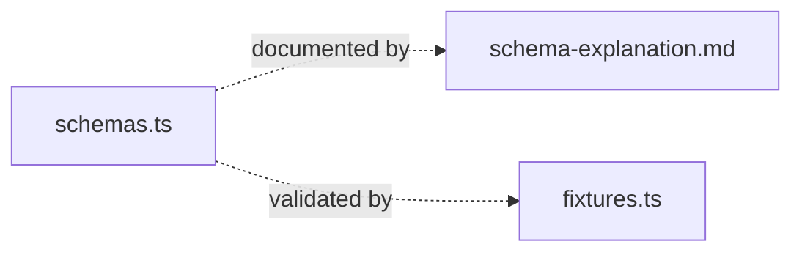

# v3-effect/

Effect Schema implementation of the score post-LLM pipeline data types.

| File | Description |
|------|-------------|
| `schemas.ts` | Effect Schema definitions for JSONScores (Schema.Class with derived getters), CurvedScores, ProblemDimensionMap, and branded primitives |
| `schema-explanation.md` | Plain-English walkthrough of every type, field, and design decision in schemas.ts |
| `fixtures.ts` | Runnable examples showing stored JSON vs decoded forms, derived getters, and encode round-trip |

