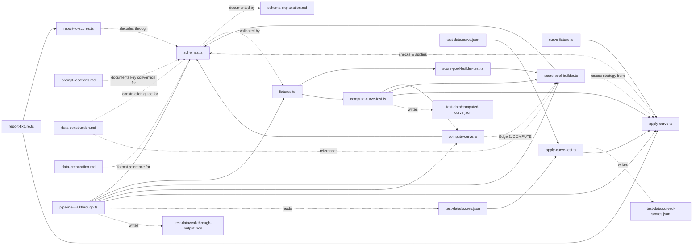

# v3-effect/

Effect Schema implementation of the score post-LLM pipeline data types.

| File | Description |
|------|-------------|
| `schemas.ts` | Effect Schema definitions for JSONScores (Schema.Class with derived getters), CurvedScores, ProblemDimensionMap, PromptSnapshot (multi-prompt provenance), and branded primitives |
| `schema-explanation.md` | Plain-English walkthrough of every type, field, and design decision in schemas.ts |
| `fixtures.ts` | Runnable examples showing stored JSON vs decoded forms, derived getters, and encode round-trip |
| `report-fixture.ts` | Sample Report JSON matching the axiia-website Report type, with realistic text + scores |
| `report-to-scores.ts` | Transform: axiia-website Report → JSONScores stored form, with verification that derived values match |
| `curve-fixture.ts` | Builder functions (buildCompatibleCurve, buildIncompatibleCurve) that derive Curve fixtures from JSONScores; prints full encoded form when run directly |
| `apply-curve.ts` | Compatibility check (checkCompatibility with swappable PromptComparisonStrategy) and curve application (applyCurve) demonstrating the full JSONScores → CurvedScores flow |
| `apply-curve-test.ts` | End-to-end test: loads JSON scores + curve from test-data/, applies curve, writes curved-scores.json |
| `test-data/scores.json` | Encoded JSONScores fixture (3 problems, 5 dimensions) |
| `test-data/curve.json` | Encoded Curve fixture matching the scores (A≥0.85, B≥0.72, C≥0.55) |
| `test-data/curved-scores.json` | Generated output: full CurvedScores with problem grades, ability grades, overall grade |
| `curve-application-analysis.md` | Analysis of how axiia-website currently applies curves: which scores get thresholds, execution order, what's not curved |
| `prompt-locations.md` | Reference doc: where scoring prompts live in axiia-website, key naming convention for PromptSnapshot entries |
| `future-todos.md` | Future TODOs and design questions: PromptSnapshot key completeness validation, ScorePool assembly validation (Q1), Curve–Score compatibility requirements (Q2) |
| `score-pool-builder.ts` | ScorePool construction functions (initPool, addScore, addEvent) with prompt snapshot and dimension map compatibility checks using Either for error handling |
| `score-pool-builder-test.ts` | Runnable tests for score-pool-builder: happy path (init + addEvent + addScore), prompt mismatch rejection, dimmap mismatch rejection, duplicate score rejection |
| `compute-curve.ts` | Edge 2 — COMPUTE: pure function `computeCurve(pool, method, label)` that statistically derives a Curve from a ScorePool using standard_deviation, percentile, or absolute methods |
| `compute-curve-test.ts` | Runnable tests for compute-curve: all three CurveMethod variants, threshold ordering/variation checks, round-trip through applyCurve, writes computed-curve.json |
| `partial-application-scenarios.md` | Catalog of all curve–score mismatch scenarios (S1–S8): which crash, which are meaningful for partial application, and what changes are needed |
| `data-construction.md` | Step-by-step guide to constructing valid JSONScores (including PromptSnapshot set_hash computation) and assembling a ScorePool |
| `data-preparation.md` | Quick reference for raw JSON formats (JSONScores, PromptSnapshot, ProblemDimensionMap, EventConfig), the 3-step load pattern, and decode/encode behavior |
| `test-data/computed-curve.json` | Generated output: Curve computed from a 6-student pool using standard_deviation method, with varying thresholds across problems and dimensions |
| `pipeline-walkthrough.ts` | Annotated end-to-end tutorial script walking through all 4 pipeline edges (COLLECT → COMPUTE → CHECK → APPLY) with heavy comments explaining each Effect Schema pattern |
| `test-data/walkthrough-output.json` | Generated output: CurvedScores produced by the walkthrough script's round-trip demonstration |

```mermaid
graph LR
    S[schemas.ts] -. "documented by" .-> E[schema-explanation.md]
    S -. "validated by" .-> F[fixtures.ts]
    RF[report-fixture.ts] --> RT[report-to-scores.ts]
    RT -. "decodes through" .-> S
    CF[curve-fixture.ts] --> AC[apply-curve.ts]
    RF --> AC
    AC -. "checks & applies" .-> S
    SJ[test-data/scores.json] --> ACT[apply-curve-test.ts]
    CJ[test-data/curve.json] --> ACT
    ACT -. "writes" .-> CSJ[test-data/curved-scores.json]
    ACT --> AC
    PL[prompt-locations.md] -. "documents key convention for" .-> S
    DC[data-construction.md] -. "construction guide for" .-> S
    DC -. "references" .-> SPB
    DP[data-preparation.md] -. "format reference for" .-> S
    SPB[score-pool-builder.ts] --> S
    SPB -. "reuses strategy from" .-> AC
    F --> SPBT[score-pool-builder-test.ts]
    SPBT --> SPB
    CC[compute-curve.ts] --> S
    CC -. "Edge 2: COMPUTE" .-> SPB
    F --> CCT[compute-curve-test.ts]
    CCT --> CC
    CCT --> SPB
    CCT --> AC
    CCT -. "writes" .-> CCJ[test-data/computed-curve.json]
    PW[pipeline-walkthrough.ts] --> S
    PW --> F
    PW --> SPB
    PW --> CC
    PW --> AC
    PW -. "reads" .-> SJ
    PW -. "writes" .-> WOJ[test-data/walkthrough-output.json]
```
